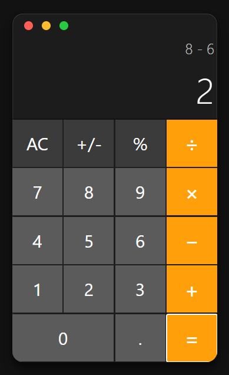

# React Redux Calculator

A modern calculator app built with **React**, **Redux Toolkit**, and **TypeScript**.  
This project demonstrates advanced state management, keyboard accessibility, and performance optimizations.

---

## Features

- **Basic Arithmetic:** Addition, subtraction, multiplication, and division using precise decimal math.
- **Keyboard Support:** Full keyboard operation, including numpad and top-row keys, with support for Shift-combinations (e.g., Shift + `=` for `+`).
- **Redux State Management:** All calculator logic and state are managed via Redux Toolkit.
- **Error Handling:** Graceful handling of invalid operations (e.g., division by zero).
- **Optimized Rendering:** Uses `React.memo` for buttons and split selectors for display to minimize unnecessary re-renders.
- **Responsive UI:** Clean, accessible, and responsive design.
- **Backspace & Clear:** Backspace deletes the last digit; Escape or AC clears all.
- **Percent, Sign Toggle:** Supports percent and sign toggle operations.
- **Result Formatting:** Results are shown without trailing decimals for integers (e.g., `300` instead of `300.00`).

---

## Keyboard Shortcuts

| Key Pressed         | Calculator Action      |
|---------------------|-----------------------|
| 0-9                 | Input digit           |
| . or ,              | Decimal point         |
| + / Shift+=         | Add                   |
| -                   | Subtract              |
| * or ×              | Multiply              |
| / or ÷              | Divide                |
| Enter or =          | Equals                |
| Backspace           | Delete last input     |
| Escape              | All Clear (AC)        |

---

## Screenshot



---

## Commands

To install dependencies:
```bash
npm install
